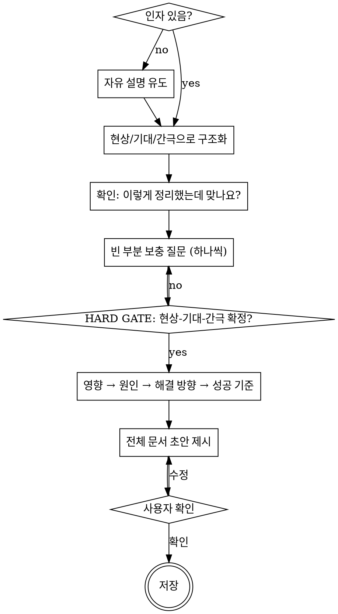

# 문제 정의 (Problem Definition)

문제 정의 프레임워크 7단계를 대화형으로 안내하여 구조화된 초안 문서를 생성한다.

## 진행 흐름

## 시작

인자가 있으면 → 바로 구조화 단계로.
인자가 없으면 → "어떤 상황이 문제라고 느끼시나요? 자유롭게 설명해 주세요."

## 구조화 단계

사용자의 자유 설명을 받으면:

1. 설명에서 **현상**(객관적 사실), **기대**(바람직한 상태), **간극**(둘 사이의 차이)에 해당하는 내용을 추출하여 분류한다.
2. 분류 결과를 사용자에게 제시하고 확인을 받는다: "이렇게 정리했는데 맞나요?"
3. 빈 부분이나 불명확한 부분은 **한 번에 하나씩** 질문한다.

## 핵심 규칙

<HARD-GATE>
현상-기대-간극이 확정되기 전에 원인(5단계)이나 해결 방향(6단계)으로 넘어가지 않는다.
이것이 이 프레임워크의 최우선 규칙이다.
</HARD-GATE>

**이 규칙은 절대적이다.** 다음 합리화에 빠지지 않는다:
- "원인이 명백하니까 바로 넘어가도 된다" → 안 된다. 간극부터 확정한다.
- "사용자가 해결책을 원하니까 빨리 가자" → 안 된다. 잘못된 문제를 빠르게 해결하는 것은 시간 낭비다.
- "간극은 암묵적으로 이미 정의된 거 아닌가" → 명시적으로 확정한다.

### 사용자 입력 교정

사용자 설명에서 다음 패턴을 감지하면 되묻는다:

| 패턴 | 예시 | 되묻기 |
|------|------|--------|
| 판단/감정/해석이 섞인 현상 | "회의가 비효율적이다" | "객관적으로 관찰되는 사실은 무엇인가요? 예: 회의 시간, 빈도, 참석자 수 등" |
| 해결책을 문제로 위장 | "Slack이 필요하다" | "어떤 상황에서 무엇이 안 되고 있나요?" |
| 증상을 원인으로 착각 | "두통이 문제다" | "그 상황이 왜 발생하는 것 같나요?" |
| 너무 넓은 정의 | "소통이 안 된다" | "누가, 언제, 어떤 종류의 소통에서 어려움을 겪나요?" |
| 간극 없이 해결책 제시 | "주간 보고서를 만들자" | "지금 어떤 정보가 부족하거나 전달이 안 되고 있나요?" |

**판단을 사실로 수용하지 않는다.** "비효율적이다", "형편없다", "안 좋다" 같은 표현은 반드시 "객관적으로 관찰되는 사실은?" 으로 되묻는다. 자체 추론으로 대체하지 않는다.

### 단계 진행 원칙

- **한 번에 한 질문** — 보충 질문은 항상 하나씩.
- **이전 단계 복귀 허용** — 원인을 분석하다가 현상을 다시 관찰해야 하면 돌아간다. 단, HARD GATE는 유지.
- **규모 적응** — 대화 중 문제 규모를 판단하고 단계를 조절:
  - 작은 문제 (개인, 일상): 현상, 기대, 간극, 해결 방향만 필수
  - 중간 문제 (팀, 프로젝트): 전체 7단계
  - 큰 문제 (조직, 사회): 전체 7단계 + 각 단계 세부 분석
- **팀원 친화** — 각 단계에서 왜 이 질문을 하는지 한 문장으로 설명한다. 예: "해결책을 찾기 전에 먼저 문제가 정확히 무엇인지 확인합니다."

### 각 단계별 세부 기준

각 단계의 좋은 예/나쁜 예, 검증 질문, 분석 도구 등은 [references/framework.md](references/framework.md)를 참조한다.

## 상태 태그

각 단계 항목에 다음 중 하나를 표기한다:

- **`확정`** — 작성자가 확신하는 내용. 데이터나 합의로 뒷받침됨.
- **`논의 필요`** — 팀 합의가 필요한 부분. 작성자의 초안은 적되, `> 논의 포인트:` 블록으로 무엇을 논의해야 하는지 명시.
- **`미정`** — 아직 정보가 부족하여 작성하지 못한 부분. 어떤 정보가 필요한지 명시.

대화 중 사용자가 "이건 확실하지 않은데", "팀에서 이야기해봐야 할 것 같은데" 같은 표현을 쓰면 해당 항목을 `논의 필요`로 표기한다.

## 출력

문서 템플릿은 [references/template.md](references/template.md)를 따른다.

저장 경로: `docs/problems/YYYY-MM-DD-<topic>.md`

문서 상단의 `상태`는 항상 `초안`으로 시작한다. 이 스킬의 산출물은 팀 논의 전 초안이다.

**반드시 템플릿 구조를 사용한다.** 자체 문서 구조를 만들지 않는다. 7단계 프레임워크의 각 단계가 문서의 각 섹션에 대응되어야 한다.
