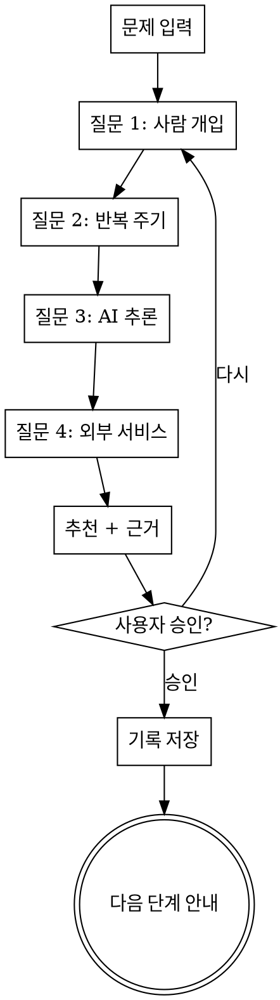

# lookup

삶의 문제에 맞는 해결 방식을 찾아주는 스킬.

## 해결 방식 후보

| 방식 | 핵심 특성 |
|---|---|
| launchd + 셸 스크립트 | 단순 스케줄, AI 불필요, 무인 실행 |
| Apple Shortcuts | OS/디바이스 통합, 크로스 디바이스 |
| Raycast 확장 | 빠른 즉석 호출, 키보드 기반 |
| n8n 워크플로우 | 이벤트 기반, 멀티서비스 연동, 무인 자동화 |
| Claude Code 스킬 | AI 추론 필요, 대화형, 복잡한 판단 |

상세 정보: `references/solution-approaches.md` 참조.

## 실행 흐름



## 1단계: 질문 (필수)

<HARD-GATE>
추천하기 전에 반드시 4가지 질문을 1개씩 한다. 질문을 건너뛰고 바로 추천하는 것은 금지.
사용자의 문제 설명만으로 답이 명확해 보여도 질문을 생략하지 않는다.
</HARD-GATE>

사용자가 문제를 입력하면, 아래 4가지를 **한 번에 1개씩** 객관식으로 질문한다.

**질문 1: 사람 개입**
> 이 문제를 해결할 때 매번 사람의 판단이 필요한가요?
> - A) 필요 없음 — 자동으로 돌아가면 됨
> - B) 가끔 필요 — 대부분 자동이지만 때때로 확인
> - C) 매번 필요 — 사람이 직접 판단해야 함

**질문 2: 반복 주기**
> 이 문제는 얼마나 자주 발생하나요?
> - A) 일회성 또는 비정기적
> - B) 매일/매주 등 정기적 스케줄
> - C) 특정 이벤트 발생 시 (이메일 도착, 웹훅 등)

**질문 3: AI 추론**
> 해결 과정에서 AI의 판단이나 창의성이 필요한가요?
> - A) 불필요 — 단순 반복/자동화
> - B) 가벼운 수준 — 분류, 요약 정도
> - C) 깊은 추론 — 설계, 분석, 창의적 생성

**질문 4: 외부 서비스**
> 어떤 외부 서비스와 연결되어야 하나요?
> - A) 없음 — 로컬에서 완결
> - B) 1-2개 서비스 (구체적으로 어떤 서비스?)
> - C) 3개 이상 서비스 연동

## 2단계: 추천

4가지 답변을 종합하여 가장 적합한 해결 방식 **1개**를 추천한다.

### 판단 가이드라인

```
사람 개입 A(불필요) + 반복 B(정기) + AI A(불필요) + 서비스 A(없음)
  → launchd + 셸 스크립트

사람 개입 A/B + 디바이스/위치 트리거 + AI A(불필요) + 서비스 A(로컬)
  → Apple Shortcuts

사람 개입 C(매번) + 반복 A(비정기) + AI A/B(가벼움) + 서비스 A/B(소수)
  → Raycast 확장

사람 개입 A(불필요) + 반복 B/C(정기/이벤트) + AI A/B(불필요~가벼움) + 서비스 B/C(다수)
  → n8n 워크플로우

사람 개입 B/C(필요) + AI C(깊은 추론)
  → Claude Code 스킬
```

이 가이드라인은 참고용이다. 답변이 엇갈리는 애매한 경우에는 어떤 기준이 더 중요한지 사용자에게 한 번 더 확인한다.

### 출력 형식

반드시 아래 형식을 따른다:

> **추천: [방식 이름]**
>
> [왜 이 방식이 적합한지 1-2문장]
>
> **다른 방식이 안 되는 이유:**
> - [방식 A]: [근거]
> - [방식 B]: [근거]
> - [방식 C]: [근거]
> - [방식 D]: [근거]

<HARD-GATE>
추천 단계에서 구현 코드, 설정 파일, 워크플로우 구성 등을 직접 작성하지 않는다.
추천 + 근거 + 다음 단계 안내만 한다. 구현은 다음 단계의 몫이다.
</HARD-GATE>

## 3단계: 기록 저장

사용자가 추천을 승인하면, 분석 결과를 파일로 저장하고 git commit한다.

**파일 경로:** `docs/lookups/YYYY-MM-DD-<주제>.md`

**파일 구조:**

```markdown
# <문제 요약 한 줄>

## 문제 정의
<사용자가 설명한 원래 문제>

## 분석
- 사람 개입: <답변>
- 반복 주기: <답변>
- AI 추론: <답변>
- 외부 서비스: <답변>

## 추천
**<추천 방식>**

<추천 근거 1-2문장>

### 다른 방식이 안 되는 이유
- <방식 A>: <근거>
- <방식 B>: <근거>
- <방식 C>: <근거>
- <방식 D>: <근거>

## 다음 단계
<구체적인 스킬/도구 안내>
```

## 4단계: 다음 단계 안내

추천 방식에 맞는 구체적인 다음 행동을 안내한다.

| 추천 방식 | 다음 단계 |
|---|---|
| launchd + 셸 스크립트 | plist 파일 작성법, 스크립트 위치, launchctl 명령어 안내 |
| Apple Shortcuts | Shortcuts 앱에서 워크플로우 생성 방법 안내 |
| Raycast 확장 | 기존 확장 검색 또는 새 확장 개발 안내 |
| n8n 워크플로우 | `n8n-workflow-patterns`, `n8n-node-configuration` 스킬 안내 |
| Claude Code 스킬 | `brainstorming` 스킬 호출 안내 |

## Red Flags — 이렇게 하면 안 된다

- 질문 없이 바로 추천으로 점프
- "답이 뻔하니까 질문 생략" — 뻔해 보여도 질문한다
- 추천하면서 구현 코드를 같이 작성
- 기록 파일 저장을 건너뜀
- 다음 단계 안내 없이 종료
