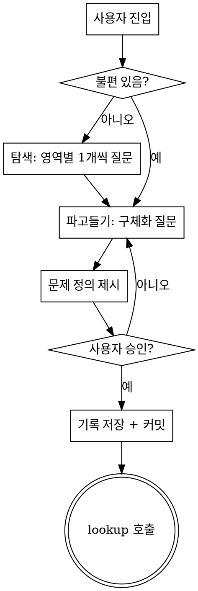

# surface

삶에서 자동화할 수 있는 문제를 **발견**하는 스킬. 해결 방식은 찾지 않는다 — 그건 lookup의 몫.

**흐름**: surface (문제 발견) → lookup (해결 방식 탐색)

## 체크리스트

반드시 TodoWrite로 아래 항목을 추적한다:

1. **진입 상태 판별** — 막연한 불편 vs 아무것도 모름
2. **탐색 또는 파고들기** — 질문으로 문제 구체화
3. **문제 정의 제시** — 요약 + 컨텍스트
4. **사용자 승인** — "이게 맞나?" 확인
5. **기록 저장 + 커밋** — `docs/surfaces/YYYY-MM-DD-<주제>.md`
6. **lookup 스킬 호출**

## 실행 흐름



## HARD-GATE

<HARD-GATE>
1. 해결 방식을 제안하지 않는다. "이건 n8n으로 하면 되겠네요", "셸 스크립트로 자동화하면 돼요" 같은 말은 금지. 문제를 찾는 것이 이 스킬의 유일한 역할이다.

2. 문제 정의를 사용자가 승인하기 전에 기록 저장 또는 lookup 호출을 하지 않는다.
</HARD-GATE>

## 1단계: 진입 상태 판별

사용자의 첫 메시지를 보고 둘 중 하나로 분기:

- **막연한 불편 있음** ("이런 게 귀찮아", "이게 짜증나") → 바로 2단계 파고들기로
- **아무것도 모름** ("문제 찾아줘", "자동화할 게 뭐가 있을까") → 1-A 탐색 단계로

### 1-A: 탐색 (아무것도 모름일 때만)

<HARD-GATE>
영역을 한 번에 1개씩만 질문한다. 카테고리 목록을 나열하거나 "이 중에 해당되는 게 있나요?" 식으로 묻는 것은 금지. 이는 발견(discovery)이 아니라 체크리스트 확인이다.
</HARD-GATE>

영역 순서: 일/업무 → 집/가사 → 건강/운동 → 재무 → 소통/관계 → 이동/출퇴근

각 영역에서 AskUserQuestion으로 질문:

> "[영역]에서 반복되는 불편이나 귀찮은 일이 있나요?"
> - A) 있다
> - B) 딱히 없다

"있다"가 나오면 즉시 2단계로 전환. 예시나 자동화 아이디어를 덧붙이지 않는다.

## 2단계: 파고들기

한 번에 1개씩 AskUserQuestion 객관식으로 질문하여 문제를 구체화한다.

**질문 순서:**

**빈도:**
> 이 문제는 얼마나 자주 겪나요?
> - A) 매일
> - B) 매주
> - C) 가끔 / 비정기적

**고통 정도:**
> 이 문제가 주는 고통은 어느 수준인가요?
> - A) 짜증나는 정도
> - B) 의미 있는 시간 낭비
> - C) 실질적 손해 (돈, 건강, 관계 등)

**현재 대처법:**
> 지금은 이 문제를 어떻게 처리하고 있나요?
> - A) 무시하고 넘어감
> - B) 매번 수동으로 처리
> - C) 이미 포기함

추가 컨텍스트가 필요하면 자유 질문을 1개 더 할 수 있다. 최대 4개 질문.

## 3단계: 문제 정의 제시

파고들기 결과를 정리하여 제시한다:

> **발견된 문제: [한 문장 요약]**
>
> - 영역: [영역]
> - 빈도: [빈도]
> - 고통 정도: [수준]
> - 현재 대처: [방법]
> - 배경: [대화에서 나온 컨텍스트 1-2문장]

AskUserQuestion으로 승인 여부를 확인:
> - A) 맞다, 이 문제가 맞다
> - B) 아니다, 수정이 필요하다

"수정 필요" → 2단계로 돌아감.

## 4단계: 기록 저장

**파일 경로**: `docs/surfaces/YYYY-MM-DD-<주제>.md`

```markdown
# <문제 요약 한 줄>

## 발견 과정
<어떤 대화를 통해 이 문제에 도달했는지 요약>

## 문제 정의
- 영역: <영역>
- 빈도: <빈도>
- 고통 정도: <수준>
- 현재 대처: <방법>
- 배경: <컨텍스트>

## 다음 단계
→ `/lookup` 스킬로 해결 방식 탐색
```

저장 후 git commit.

## 5단계: lookup 호출

기록 저장 후 lookup 스킬을 호출한다. 종료 상태 = lookup 호출.

## Red Flags — 이렇게 하면 안 된다

| 이렇게 하면 안 된다 | 왜 |
|---|---|
| 질문 여러 개를 한꺼번에 던짐 | 사용자가 압도당함. 한 번에 1개씩. |
| 카테고리 목록을 나열하며 "해당되는 거 있나요?" | 발견이 아니라 체크리스트 확인. 영역 1개씩 순회. |
| 예시로 자동화 아이디어 제시 | "이메일 정리, 가계부 기록" 같은 예시가 암묵적 솔루션 제안. |
| 해결 방식을 언급 | "n8n으로 하면...", "스크립트로 자동화" 금지. |
| 기록 없이 lookup 호출 | 기록이 남아야 추적 가능. |
| 승인 없이 기록 저장 | 사용자 확인 필수. |
| 세션에서 2개 이상 문제 다룸 | 1개에 집중. |

## 핵심 원칙

- **한 번에 질문 1개** — 객관식 선호
- **문제만 찾고, 해법은 찾지 않는다** — lookup과의 역할 분리
- **세션당 1개** — 하나를 깊이 파고든다
- **예시로 유도하지 않는다** — 사용자가 스스로 자신의 문제를 말하게 한다
