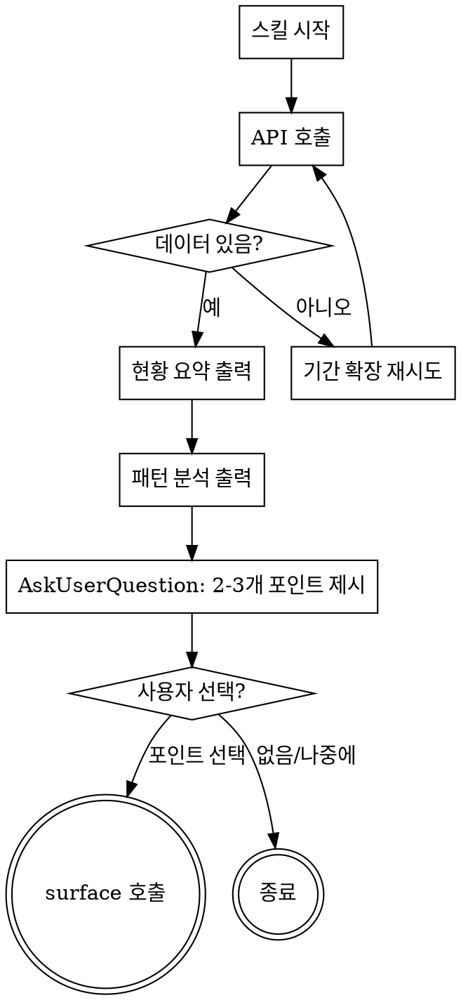

# work-scan

Linear/GitHub 업무 데이터를 스캔하여 해결할 수 있는 포인트를 발견하는 스킬. 해결 방식은 찾지 않는다 — 그건 surface → lookup의 몫.

**흐름**: work-scan (데이터 기반 문제 후보 발견) → surface (문제 정의) → lookup (해결 방식 탐색)

## 체크리스트

반드시 TodoWrite로 아래 항목을 추적한다:

1. **데이터 수집** — 맥락 조회 API 호출
2. **현황 요약** — 소스별/상태별 분류 출력
3. **패턴 분석** — 장기 체류, 리뷰 대기 등 패턴 탐지
4. **제안** — 2-3개 액션 포인트를 AskUserQuestion으로 제시
5. **사용자 선택** — 관심 포인트 확인
6. **surface 스킬 호출** — 선택된 포인트로 문제 정의 진행

## 실행 흐름



## HARD-GATE

<HARD-GATE>
1. 데이터 없이 추측하지 않는다. 반드시 조회 API를 호출한 후 분석한다. API 호출 전에 어떤 분석도 하지 않는다.

2. 해결 방식을 제안하지 않는다. "n8n으로 자동화하면 돼요", "API를 보강하세요" 같은 말은 금지. 문제 후보를 발견하는 것이 이 스킬의 유일한 역할이다. 해결은 surface → lookup의 몫.

3. 제안은 최대 3개로 제한한다. 4개 이상 나열하면 사용자가 선택하기 어렵다.

4. surface 연결은 사용자가 포인트를 선택한 후에만 한다. 일방적으로 연결하지 않는다.

5. 모든 내용을 한꺼번에 출력하지 않는다. 현황 요약 → 패턴 분석 → 제안 순서를 반드시 지킨다.
</HARD-GATE>

## 1단계: 데이터 수집

**기간 결정:**
- ARGUMENTS에 숫자가 있으면 해당 값을 `days`로 사용 (예: `/work-scan 90` → `days=90`)
- 숫자가 없으면 기본값 `days=14`
- 유효 범위: 1~365. 범위 밖이면 기본값 14 사용

WebFetch로 맥락 조회 API를 호출한다:

```
GET https://unu.unuuuuu.com/webhook/get-my-context?days={결정된 days}
```

- 프롬프트: "Return the full response text as-is without summarizing"
- 데이터가 "수집된 맥락이 없습니다"이면:
  - 기본값(14일)으로 호출한 경우 → `?days=30`으로 재시도
  - 사용자 지정 기간인 경우 → 재시도 없이 "해당 기간에 수집된 데이터가 없습니다." 안내 후 종료
- 30일에도 없으면 "수집된 업무 데이터가 없습니다. Linear/GitHub 웹훅이 정상 작동하는지 확인해주세요." 안내 후 종료

## 2단계: 현황 요약

반환된 데이터에서 팩트만 정리한다:

```
### 현황 요약 ({days}일)
- Linear: N건 (In Progress M건, Todo K건, Done J건)
- GitHub: PR N건, Push M건, Review K건
- 활동 프로젝트: project1, project2
```

30일 이상일 때는 시간 분포도 추가한다:
```
- 활동 분포: 최근 14일 N건, 그 이전 M건
```

해석이나 판단을 넣지 않는다. 숫자와 분류만.

## 3단계: 패턴 분석

데이터에서 다음 패턴을 탐지하여 출력한다:

**기본 패턴 (항상 탐지):**
- **장기 체류**: 같은 상태에 7일 이상 머문 이슈
- **우선순위 불일치**: P1-P2인데 진전 없는 이슈
- **리뷰 대기**: 오픈 상태로 방치된 PR
- **활동 공백**: 특정 프로젝트에 활동이 없는 기간
- **반복 키워드**: 여러 이슈/PR에 걸쳐 나타나는 주제

**장기 패턴 (30일+ 데이터일 때 추가 탐지):**
- **반복 작업**: 비슷한 유형의 이슈가 여러 번 등장 (예: 같은 종류의 고객 문의, 같은 도메인의 마이그레이션 작업)
- **완료 후 재등장**: Done 처리된 주제와 비슷한 이슈가 새로 등장
- **프로젝트 집중도 변화**: 특정 프로젝트에 활동이 몰렸다가 사라지는 패턴
- **상태 순환**: 이슈가 상태를 왔다갔다 하는 패턴 (In Progress ↔ Todo 등)

```
### 패턴 관찰
- HAP-12가 10일째 In Progress 상태 (P2)
- repo-x에 PR 2건이 리뷰 없이 3일 대기 중
- [장기] "고객 문의" 관련 이슈가 90일간 8건 반복 등장
- [장기] NestJS 마이그레이션 이슈가 6개 도메인에 걸쳐 순차 진행 중
```

관찰 가능한 사실만 적는다. "이렇게 하세요"는 금지.

## 4단계: 제안

AskUserQuestion으로 2-3개 포인트를 제시한다. 각 포인트는:
- **무엇이 눈에 띄는지** (패턴에서 도출)
- **왜 주목할 만한지** (반복, 지연, 집중도 등)

해결 방법은 포함하지 않는다.

## 5단계: 사용자 선택

사용자가 포인트를 선택하면 6단계로. "없음" 또는 "나중에"를 선택하면 종료.

## 6단계: surface 호출

선택된 포인트의 맥락을 요약하여 surface 스킬을 호출한다:

```
사용자가 /work-scan에서 다음 포인트를 선택했습니다:
- [포인트 요약]
- 관련 데이터: [이슈/PR 목록]
이 포인트를 구체적인 문제로 정의해주세요.
```

## 실수 방지

| 하기 쉬운 실수 | 올바른 행동 |
|---|---|
| "API를 보강하세요" 같은 해결책 제안 | 문제만 발견, 해결은 surface→lookup |
| 데이터 없이 일반론 제시 | 반드시 API 호출 후 데이터 기반 분석 |
| 5개 이상 제안 나열 | 최대 3개, AskUserQuestion으로 선택 유도 |
| 한꺼번에 모든 내용 출력 | 요약 → 패턴 → 제안 순서 엄수 |
| surface 없이 바로 해결 시도 | 포인트 선택 후 surface 호출 |
