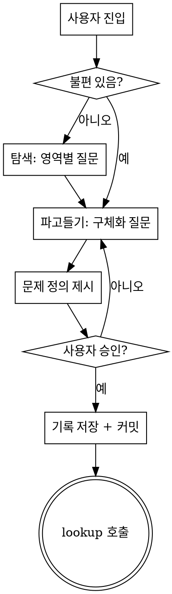

# surface 스킬 설계

## 개요

삶에서 자동화할 수 있는 문제를 **발견**하는 브레인스토밍 스킬. lookup 스킬의 전 단계로, 문제를 찾는 것이 역할이며 해결 방식은 찾지 않는다.

**흐름**: surface (문제 발견) → lookup (해결 방식 탐색)

## 진입 상태

| 상태 | 설명 | 스킬 동작 |
|---|---|---|
| 막연한 불편 있음 | "이런 게 귀찮아" 같은 감정/상황을 가지고 옴 | 바로 "파고들기" 단계로 |
| 아무것도 모름 | "문제가 있는지도 모르겠는데 찾아줘" | "탐색" 단계에서 영역별 질문으로 시작 |

## 실행 흐름



## 단계별 상세

### 1단계: 탐색 (진입 상태가 "아무것도 모름"일 때만)

삶의 영역을 한 번에 1개씩 객관식으로 질문하며 불편을 탐색한다.

영역 목록: 일/업무, 집/가사, 건강/운동, 재무, 소통/관계, 이동/출퇴근

> "이 영역에서 반복되는 불편이나 귀찮은 일이 있나요?"
> - A) 있다 — (간단히 설명)
> - B) 딱히 없다 — 다음 영역으로

불편 후보가 발견되면 파고들기 단계로 전환.

### 2단계: 파고들기

발견된 불편을 구체적 문제로 정제한다. 한 번에 1개씩 객관식 질문.

**질문 예시:**
- 빈도: 매일 / 매주 / 가끔 / 비정기
- 고통 정도: 짜증나는 수준 / 시간을 의미있게 낭비 / 실질적 손해(돈, 건강 등)
- 현재 대처법: 무시하고 넘어감 / 매번 수동으로 처리 / 이미 포기함
- 추가 컨텍스트가 필요하면 자유 질문도 가능

### 3단계: 문제 정의 제시

파고들기 결과를 정리하여 사용자에게 제시.

> **발견된 문제: [한 문장 요약]**
>
> - 영역: [영역]
> - 빈도: [빈도]
> - 고통 정도: [수준]
> - 현재 대처: [방법]
> - 배경: [대화에서 나온 추가 컨텍스트 1-2문장]

사용자가 "이게 맞다"고 승인해야 다음 단계로 진행.

### 4단계: 기록 저장

**파일 경로**: `docs/surfaces/YYYY-MM-DD-<주제>.md`

```markdown
# <문제 요약 한 줄>

## 발견 과정
<어떤 대화를 통해 이 문제에 도달했는지 요약>

## 문제 정의
- 영역: <영역>
- 빈도: <빈도>
- 고통 정도: <수준>
- 현재 대처: <방법>
- 배경: <컨텍스트>

## 다음 단계
→ `/lookup` 스킬로 해결 방식 탐색
```

저장 후 git commit.

### 5단계: lookup 호출

기록 저장 후 lookup 스킬을 호출한다. 종료 상태 = lookup 호출.

## HARD-GATE

1. **탐색/파고들기 단계에서 해결 방식을 제안하지 않는다.** "이건 n8n으로 하면 되겠네요" 같은 말은 금지. 그건 lookup의 몫.

2. **문제 정의를 사용자가 승인하기 전에 기록 저장 / lookup 호출을 하지 않는다.**

## 핵심 원칙

- **한 번에 질문 1개** — brainstorming 스킬과 동일한 패턴
- **객관식 선호** — 열린 질문보다 선택지 제공
- **문제만 찾고, 해법은 찾지 않는다** — lookup과의 명확한 역할 분리
- **세션당 1개** — 하나의 문제를 깊이 파고든다
- **YAGNI** — 문제 정의에 불필요한 정보를 넣지 않음

## Red Flags

| 이렇게 하면 안 된다 | 이유 |
|---|---|
| 질문 없이 바로 문제 정의 | 충분히 파고들지 않은 문제는 부정확 |
| 해결 방식 제안 | 그건 lookup의 역할 |
| 여러 문제를 한꺼번에 정의 | 세션당 1개에 집중 |
| 기록 없이 lookup 호출 | 기록이 남아야 나중에 추적 가능 |
| 승인 없이 기록 저장 | 사용자가 확인해야 함 |

## 레퍼런스 스킬

- `superpowers:brainstorming` — 대화 패턴, 체크리스트, HARD-GATE 구조 참고
- `lookup` — 후행 스킬, 출력 형식이 lookup의 입력이 됨
