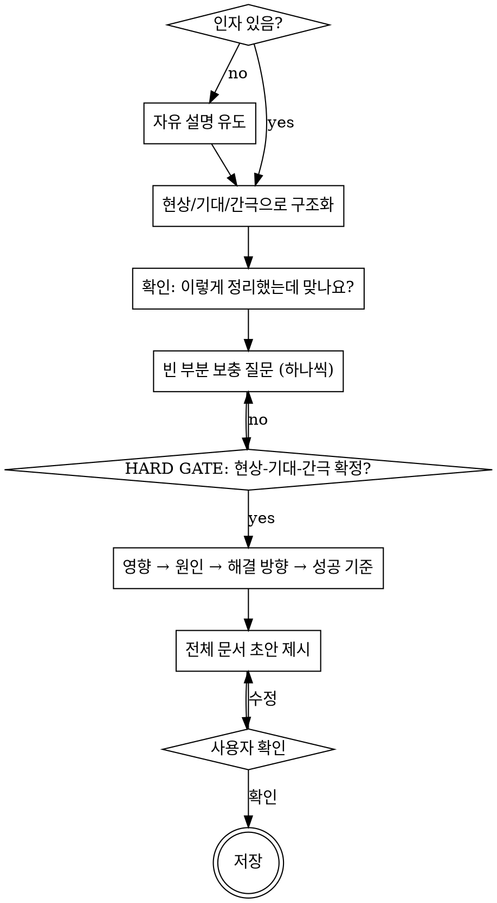

# define-problem Skill Implementation Plan

> **For Claude:** REQUIRED SUB-SKILL: Use superpowers:executing-plans to implement this plan task-by-task.

**Goal:** Create a `define-problem` skill that guides users through a 7-step problem definition framework via conversational interaction, producing a structured Markdown draft document.

**Architecture:** Three files — SKILL.md (process flow, rules, output format), references/framework.md (full framework text with examples and validation questions), references/template.md (output document template). Installed as a user-level skill in `~/.agents/skills/define-problem/` with a symlink in `~/.claude/skills/`.

**Tech Stack:** Markdown skill files, Claude Code skill system

---

### Task 1: Create skill directory structure

**Files:**
- Create: `~/.agents/skills/define-problem/`
- Create: `~/.agents/skills/define-problem/references/`

**Step 1: Create directories**

```bash
mkdir -p ~/.agents/skills/define-problem/references
```

**Step 2: Verify**

Run: `ls -la ~/.agents/skills/define-problem/`
Expected: Empty directory with `references/` subdirectory

**Step 3: Create symlink for skill registration**

```bash
ln -s ../../.agents/skills/define-problem ~/.claude/skills/define-problem
```

**Step 4: Verify symlink**

Run: `ls -la ~/.claude/skills/define-problem`
Expected: Symlink pointing to `../../.agents/skills/define-problem`

---

### Task 2: Write references/framework.md

This is the full framework text that SKILL.md references during each step. Copy from the existing design document with no modifications.

**Files:**
- Create: `~/.agents/skills/define-problem/references/framework.md`
- Source: `docs/plans/2026-03-01-problem-definition-framework-design.md`

**Step 1: Copy framework content**

Copy the entire content of `docs/plans/2026-03-01-problem-definition-framework-design.md` into `~/.agents/skills/define-problem/references/framework.md` verbatim.

**Step 2: Verify**

Run: `wc -l ~/.agents/skills/define-problem/references/framework.md`
Expected: 307 lines (matches source)

---

### Task 3: Write references/template.md

The output document template that the skill fills in during conversation.

**Files:**
- Create: `~/.agents/skills/define-problem/references/template.md`

**Step 1: Write template file**

```markdown
# 문제 정의: {제목}

> 작성자: {작성자} | 작성일: {날짜} | 상태: 초안

---

## 1. 현상 (Observation)

**상태: {확정|논의 필요|미정}**

{객관적 사실 기술}

---

## 2. 기대 (Expectation)

**상태: {확정|논의 필요|미정}**

{바람직한 상태}

> 기대의 근거: {합의|데이터|관행|직관}

---

## 3. 간극 (Gap)

**상태: {확정|논의 필요|미정}**

{현상과 기대 사이의 차이 — 정량적 또는 정성적}

---

## 4. 영향 (Impact)

**상태: {확정|논의 필요|미정}**

- **범위:** {누가, 얼마나}
- **심각도:** {영향의 정도}
- **긴급도:** {시간에 따른 변화}
- **비가역성:** {되돌릴 수 없는 결과 여부}

---

## 5. 원인 (Cause)

**상태: {확정|논의 필요|미정}**

{근본 원인 분석}

| 원인 | 기여도 | 제거 가능성 | 우선순위 |
|------|--------|-------------|----------|
| | | | |

---

## 6. 해결 방향 (Direction)

**상태: {확정|논의 필요|미정}**

| 기준 | 대안 A | 대안 B | 대안 C |
|------|--------|--------|--------|
| 원인 대응도 | | | |
| 실행 가능성 | | | |
| 비용 | | | |
| 부작용 | | | |
| 지속 가능성 | | | |

---

## 7. 성공 기준 (Success Criteria)

**상태: {확정|논의 필요|미정}**

{간극이 줄어들었는지 판단하는 구체적 기준}
```

**Step 2: Verify**

Run: `head -5 ~/.agents/skills/define-problem/references/template.md`
Expected: `# 문제 정의: {제목}` header visible

---

### Task 4: Write SKILL.md

The main skill file with YAML frontmatter, process flow, rules, and instructions.

**Files:**
- Create: `~/.agents/skills/define-problem/SKILL.md`

**Step 1: Write SKILL.md**

```markdown
---
name: define-problem
description: 문제 정의 프레임워크를 사용하여 문제를 구조화된 문서로 정의. 문제를 분석하거나, 문제 정의를 요청하거나, 문제 상황을 설명할 때 사용.
---

# 문제 정의 (Problem Definition)

문제 정의 프레임워크 7단계를 대화형으로 안내하여 구조화된 초안 문서를 생성한다.

## 진행 흐름



## 시작

인자가 있으면 → 바로 구조화 단계로.
인자가 없으면 → "어떤 상황이 문제라고 느끼시나요? 자유롭게 설명해 주세요."

## 구조화 단계

사용자의 자유 설명을 받으면:

1. 설명에서 **현상**(객관적 사실), **기대**(바람직한 상태), **간극**(둘 사이의 차이)에 해당하는 내용을 추출하여 분류한다.
2. 분류 결과를 사용자에게 제시하고 확인을 받는다: "이렇게 정리했는데 맞나요?"
3. 빈 부분이나 불명확한 부분은 **한 번에 하나씩** 질문한다.

## 핵심 규칙

<HARD-GATE>
현상-기대-간극이 확정되기 전에 원인(5단계)이나 해결 방향(6단계)으로 넘어가지 않는다.
이것이 이 프레임워크의 최우선 규칙이다.
</HARD-GATE>

### 사용자 입력 교정

사용자 설명에서 다음 패턴을 감지하면 되묻는다:

| 패턴 | 예시 | 되묻기 |
|------|------|--------|
| 판단/감정/해석이 섞인 현상 | "회의가 비효율적이다" | "객관적으로 관찰되는 사실은 무엇인가요? 예: 회의 시간, 빈도, 참석자 수 등" |
| 해결책을 문제로 위장 | "Slack이 필요하다" | "어떤 상황에서 무엇이 안 되고 있나요?" |
| 증상을 원인으로 착각 | "두통이 문제다" | "그 상황이 왜 발생하는 것 같나요?" |
| 너무 넓은 정의 | "소통이 안 된다" | "누가, 언제, 어떤 종류의 소통에서 어려움을 겪나요?" |
| 간극 없이 해결책 제시 | "주간 보고서를 만들자" | "지금 어떤 정보가 부족하거나 전달이 안 되고 있나요?" |

### 단계 진행 원칙

- **한 번에 한 질문** — 보충 질문은 항상 하나씩.
- **이전 단계 복귀 허용** — 원인을 분석하다가 현상을 다시 관찰해야 하면 돌아간다. 단, HARD GATE는 유지.
- **규모 적응** — 대화 중 문제 규모를 판단하고 단계를 조절:
  - 작은 문제 (개인, 일상): 현상, 기대, 간극, 해결 방향만 필수
  - 중간 문제 (팀, 프로젝트): 전체 7단계
  - 큰 문제 (조직, 사회): 전체 7단계 + 각 단계 세부 분석
- **팀원 친화** — 각 단계에서 왜 이 질문을 하는지 한 문장으로 설명한다. 예: "해결책을 찾기 전에 먼저 문제가 정확히 무엇인지 확인합니다."

### 각 단계별 세부 기준

각 단계의 좋은 예/나쁜 예, 검증 질문, 분석 도구 등은 [references/framework.md](references/framework.md)를 참조한다.

## 상태 태그

각 단계 항목에 다음 중 하나를 표기한다:

- **`확정`** — 작성자가 확신하는 내용. 데이터나 합의로 뒷받침됨.
- **`논의 필요`** — 팀 합의가 필요한 부분. 작성자의 초안은 적되, `> 논의 포인트:` 블록으로 무엇을 논의해야 하는지 명시.
- **`미정`** — 아직 정보가 부족하여 작성하지 못한 부분. 어떤 정보가 필요한지 명시.

대화 중 사용자가 "이건 확실하지 않은데", "팀에서 이야기해봐야 할 것 같은데" 같은 표현을 쓰면 해당 항목을 `논의 필요`로 표기한다.

## 출력

문서 템플릿은 [references/template.md](references/template.md)를 따른다.

저장 경로: `docs/problems/YYYY-MM-DD-<topic>.md`

문서 상단의 `상태`는 항상 `초안`으로 시작한다. 이 스킬의 산출물은 팀 논의 전 초안이다.
```

**Step 2: Verify YAML frontmatter**

Run: `head -4 ~/.agents/skills/define-problem/SKILL.md`
Expected:
```
---
name: define-problem
description: 문제 정의 프레임워크를 사용하여 문제를 구조화된 문서로 정의. 문제를 분석하거나, 문제 정의를 요청하거나, 문제 상황을 설명할 때 사용.
---
```

---

### Task 5: Verify skill registration

**Step 1: Check skill appears in the skills list**

Run: `ls -la ~/.claude/skills/define-problem`
Expected: Symlink pointing to define-problem skill directory

**Step 2: Check all files exist**

Run: `find ~/.agents/skills/define-problem -type f | sort`
Expected:
```
/Users/unu/.agents/skills/define-problem/SKILL.md
/Users/unu/.agents/skills/define-problem/references/framework.md
/Users/unu/.agents/skills/define-problem/references/template.md
```

**Step 3: Validate SKILL.md frontmatter**

Run: `head -4 ~/.agents/skills/define-problem/SKILL.md`
Expected: Valid YAML frontmatter with `name: define-problem`

**Step 4: Commit**

```bash
git add docs/plans/2026-03-01-define-problem-skill-design.md docs/plans/2026-03-01-define-problem-skill-implementation.md
git commit -m "docs: add define-problem skill design and implementation plan"
```

Note: The skill files themselves live in `~/.agents/skills/` (outside the repo) and are not committed to this project.

---

### Task 6: Test skill by invoking it

**Step 1: Invoke the skill without arguments**

In a new Claude Code session, run: `/define-problem`

Expected behavior:
- Skill loads and asks "어떤 상황이 문제라고 느끼시나요?"
- Proceeds through the conversational flow

**Step 2: Invoke the skill with arguments**

Run: `/define-problem "팀 회의가 매주 2시간 넘게 진행되고 있는데 실질적으로 결정되는 것이 없다"`

Expected behavior:
- Skill loads and immediately structures the input into 현상/기대/간극
- Asks for confirmation before proceeding

**Step 3: Verify output document**

After completing a full session, check:
- File saved to `docs/problems/YYYY-MM-DD-<topic>.md`
- Template structure matches `references/template.md`
- Status tags (확정/논의 필요/미정) appear on each section
- Document header shows `상태: 초안`
